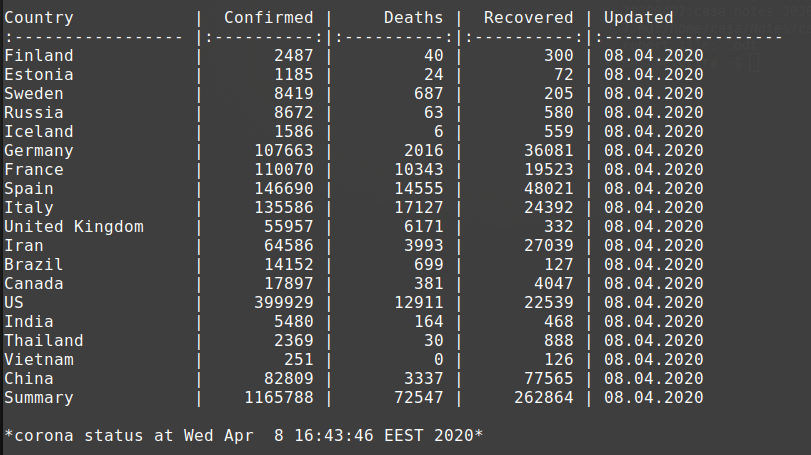

# terminal-corona view COVID-19 status in linux shell

Linux shell script to view current corona infection status wold wide.

- view mode with history browser
- country history tables with starting and ending parameters
- markdown table, text and raw output for documentation use

## Data source

CSSE at Johns Hopkins University COVID-19 git database at github.

https://github.com/CSSEGISandData/COVID-19/blob/web-data/data/cases_country.csv

## Screenshot

*(./terminal-corona.sh (-t is now default))*

*(./terminal-corona.sh view headers off timestamps off))*

*(./terminal-corona.sh history Spain 20200222 20200403)*

*(./terminal-corona.sh md short)*

result in github markdown

Country            |  Confirmed |     Deaths |  Recovered | Updated
:----------------- |:----------:|:----------:|:----------:|:------------------
Finland            |       2487 |         40 |        300 | 08.04.2020
Estonia            |       1185 |         24 |         72 | 08.04.2020
Sweden             |       8419 |        687 |        205 | 08.04.2020
Russia             |       8672 |         63 |        580 | 08.04.2020
Iceland            |       1586 |          6 |        559 | 08.04.2020
Germany            |     107663 |       2016 |      36081 | 08.04.2020
France             |     110070 |      10343 |      19523 | 08.04.2020
Spain              |     146690 |      14555 |      48021 | 08.04.2020
Italy              |     135586 |      17127 |      24392 | 08.04.2020
United Kingdom     |      55957 |       6171 |        332 | 08.04.2020
Iran               |      64586 |       3993 |      27039 | 08.04.2020
Brazil             |      14152 |        699 |        127 | 08.04.2020
Canada             |      17897 |        381 |       4047 | 08.04.2020
US                 |     399929 |      12911 |      22539 | 08.04.2020
India              |       5480 |        164 |        468 | 08.04.2020
Thailand           |       2369 |         30 |        888 | 08.04.2020
Vietnam            |        251 |          0 |        126 | 08.04.2020
China              |      82809 |       3337 |      77565 | 08.04.2020
Summary            |    1165788 |      72547 |     262864 | 08.04.2020

*corona status at Wed Apr  8 16:43:46 EEST 2020*

## Help output

    COVID-19 status viewer   ҉ help ------------------------- casa@ujo.guru
    a Linux shell script to view current corona infection status worldwide

    usage:   terminal-corona -t|h [output] all|short|List Country

    output:
      status [all|short or list]     current table view
      history [country]              table of history with changes
      txt [all|short or list]        tight text output
      csv [all|short or list]        csv output
      md [all|short or list]         markdown table
      raw 'separator'                raw output with selectable separator
      web                            open web view in source github page
      view -i 'sec'                  status loop, updates hourly or input)
                                     loop commands:
                                       n|p   jump to next or previous day
                                       h     headers on or off toggle
                                       t     time stamp toggle
                                       q     quit from loop
      rebase                         reset history data
      remove                         remove database
      help                           help view

    flags:
      -d                             date in format YYYYMMDD

    All except history can take argument 'all' or 'short'
    or list of countriesies typed with capital first letter. If country is
    left blank default country list is used. Flags are place oriented and
    cannot be combined.

    examples:
        current status of countries
                  ./terminal-corona.sh Estonia Sweden Russia
        printout current status in csv format
                  ./terminal-corona.sh csv Germany France Egypt
        printout with given separator '_'
                  ./terminal-corona.sh raw '_' Barbuda Dominican Kyrgyzstan
        update status in every 5 minutes
                  ./terminal-corona.sh view -i 300
        printout in markdown
                  ./terminal-corona.sh md all
        to show day status in history
                  ./terminal-corona.sh -d 20200122 status
        to navigate history from first record
                  ./terminal-corona.sh -d 20200122 view
        history between given day stamps
                  ./terminal-corona.sh history Spain 20200122 20200310

