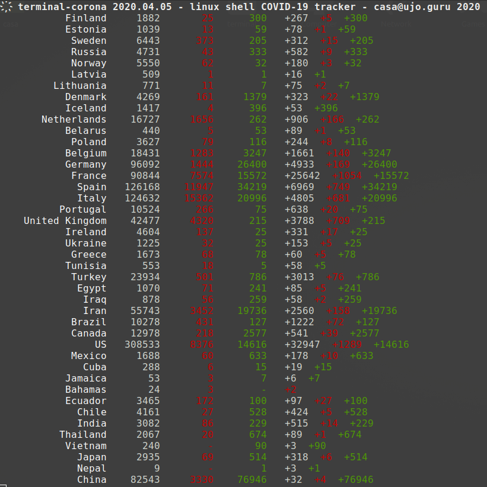
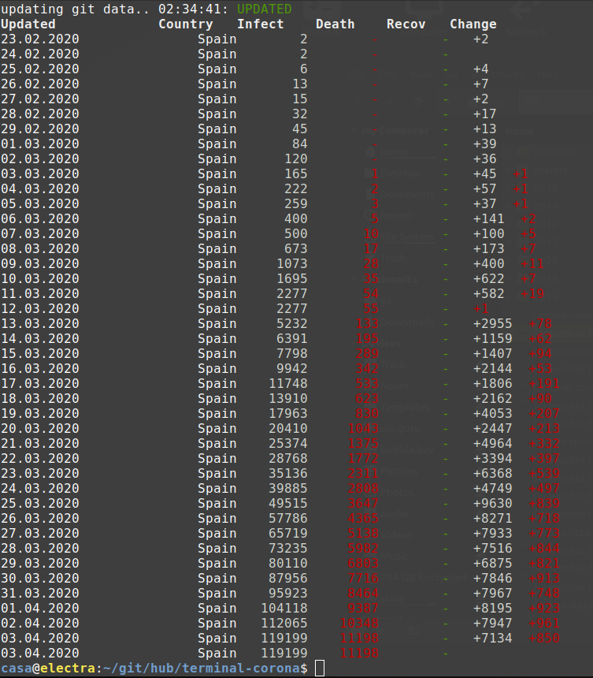

# terminal-corona view COVID-19 status in linux shell

Linux shell script to view current corona infection status wold wide (except. Korea).

- view mode with history browser
- country history tables with starting and ending parameters
- markdown table, text and raw output for documentation use

## Data source

CSSE at Johns Hopkins University COVID-19 git database at github.

https://github.com/CSSEGISandData/COVID-19/blob/web-data/data/cases_country.csv

## Screenshot

*./terminal-corona.sh*

*./terminal-corona.sh view*

*./terminal-corona.sh history Spain 20200222 20200403*

## Help output

    COVID-19 status viewer - help ---------------------------- casa@ujo.guru   ҉

    a Linux shell script to view current corona infection status worldwide

    usage:   terminal-corona -t|h [output] all|Country List

    output:
      status [all|List Of Country]   current table view
      history [Country]              table of history with changes
      txt                            tight text output
      csv                            csv output
      md                             markdown table
      raw 'separator'                raw output with selectable separator
      web                            open web view in source github page
      view -i 'sec'                  status loop, updates hourly or input (s)
                                     loop commands:
                                       n|p   jump to next or previous day
                                       h     headers on or off toggle
                                       t     time stamp toggle
                                       q     quit from loop
      help                           help view

    flags:
      -d                             date in format YYYYMMDD

    All except view history can take argument 'all' to list all countries status
    or list of country typed with capital first letter. If left blanc county
    of interest is used. Flags are place oriented and cannot be combined.

    examples:    ./terminal-corona.sh -t Estonia Sweden Russia
                 ./terminal-corona.sh -h csv Germany France Egypt
                 ./terminal-corona.sh raw '_' Barbuda Dominican Kyrgyzstan
                 ./terminal-corona.sh -h view -i 300
                 ./terminal-corona.sh md all
                 ./terminal-corona.sh -d 20200220 view
                 ./terminal-corona.sh history Finland 20200220 20200310

