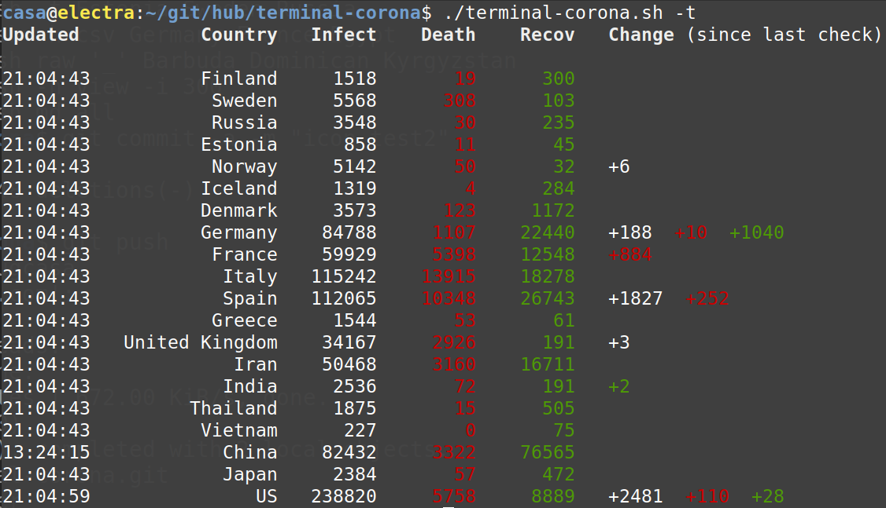

# terminal-corona   ҉ view COVID-19 status in linux shell

Linux shell script to view current corona infection status per country.

1. clone web-data branch from https://github.com/CSSEGISandData/COVID-19.git to temp folder
2. parse interesting list country data and show it in terminal.

Table, list and single line output plus loop mode with settable update time.

## Data source

CSSE at Johns Hopkins University COVID-19 git database at github.

https://github.com/CSSEGISandData/COVID-19/blob/web-data/data/cases_country.csv

## Help output

    -- ujo.guru - terminal-corona - help ---------------------------------
    a linux shell script to view current corona infection status worldwide

    usage:   terminal-corona -main_flag [output type] -sub_flag Country List

    output types:
      status                    colorful table view
      view -i 'sec'             status loop, updates hourly or
                                input amount of seconds
      txt                       tight text output
      csv                       csv output
      md                        markdown table
      raw 'separator'           raw output with selectable separator
      web                       open web view in source github page
      help                      help view
    flags:
      -t                        to activate timestamps
      -h                        set headers on or off
                                main flags cannot be combined

    examples:    ./terminal-corona.sh -t Estonia Sweden Russia
                 ./terminal-corona.sh -h csv Germany France Egypt
                 ./terminal-corona.sh raw '_' Barbuda Dominican Kyrgyzstan
                 ./terminal-corona.sh -h view -i 300

## Screen shot

"
